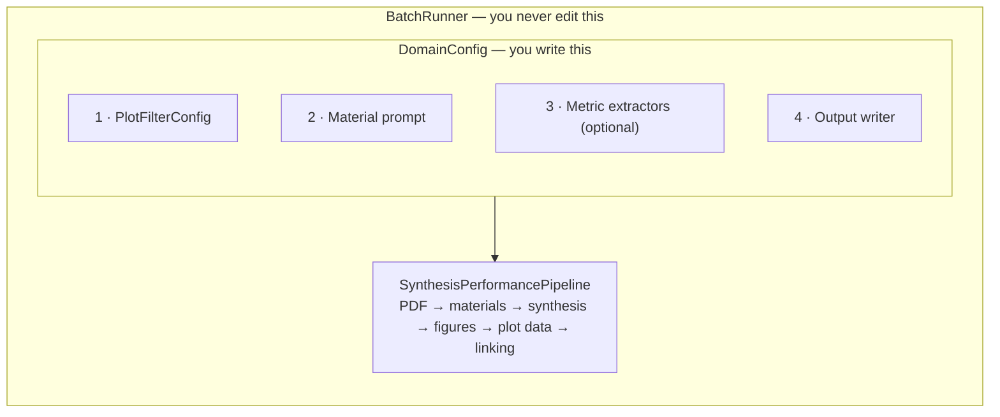

# Building Your Own Case Study

Pointing LeMat-Synth at a new scientific domain — electrochemistry, battery
cycling, thermoelectrics, photocatalysis — does not require touching the
pipeline. You assemble a `DomainConfig` from four pieces and hand it to
`BatchRunner`, which already knows how to find PDFs, detect supplementary
files, retry on rate limits, resume interrupted runs, and report progress.



Everything below builds up to a complete worked example: the porosity case
study, from an empty file to a running script.

> [!TIP]
> Prefer to work through this by running it?
> [Tutorial 7 — Building a custom case study](../tutorials/index.md) builds a
> thermoelectrics domain from scratch in a notebook, testing each of the four
> pieces as it goes. Most of it costs nothing to run, and it works on Colab
> without a local install.

---

## 1 · `PlotFilterConfig` — which plots are relevant?

A paper contains many figures — XRD patterns, SEM images, TGA curves — and only
a few of them carry the performance data you care about. `PlotFilterConfig`
matches axis labels and units so that only domain-relevant plots reach the
downstream VLM, which is both a quality and a cost decision.

Start from a preset if one fits:

```python
from llm_synthesis.config.plot_filter_config import PlotFilterConfig

PlotFilterConfig.for_catalysis()          # T vs. conversion / yield
PlotFilterConfig.for_superconductivity()  # R(T) / ρ(T)
PlotFilterConfig.for_electrochemistry()   # current / capacitance vs. voltage
PlotFilterConfig.for_coverage()           # P vs. adsorption isotherms
PlotFilterConfig.no_filter()              # keep every plot
```

Or build one:

```python
filter_cfg = PlotFilterConfig(
    x_axis_labels=["current density", "j"],
    x_axis_units=["ma/cm2", "a/cm2"],
    y_axis_keywords=["overpotential", "faradaic efficiency"],
    y_axis_units=["%", "mv"],
    filter_x_axis=True,
    filter_y_axis=True,
)
```

| Field | Purpose |
|---|---|
| `x_axis_labels` | Substrings matched case-insensitively against the x-axis label |
| `x_axis_units` | Unit strings that also signal a relevant x-axis |
| `y_axis_keywords` | Substrings matched against the y-axis label |
| `y_axis_units` | Unit strings that signal a relevant y-axis |
| `y_axis_exclude_patterns` | Veto list — overrides keyword matches (e.g. exclude *field* for superconductors) |
| `filter_x_axis` / `filter_y_axis` | Set either to `False` to ignore that axis entirely |

> [!TIP]
> Write the veto list before you think you need it. Most false positives come
> from plots that share vocabulary with the real thing — a *selectivity vs.
> temperature* curve looks a lot like a *conversion vs. temperature* curve to a
> keyword matcher.

Full field reference: [Configuration API](../api/configuration.md).

---

## 2 · Material extraction prompt — what to look for?

Two strings steer the material extractor:

- **`material_extraction_instructions`** — free-text instructions to the LLM. Be
  specific about variants, dopings and loadings.
- **`material_output_description`** — the expected output format, e.g.
  *"comma-separated chemical formulas including loading percentages"*.

Everything downstream depends on these. If the extractor returns `"Ru/MgO"` when
the paper studies four different Ru loadings, the synthesis extractor will merge
four recipes into one and the linker will have nothing to attach the four
performance curves to. Say explicitly whether each doping level is its own
entry, whether precursors count, and whether to include variant labels.

---

## 3 · Domain metric extractors (optional)

Beyond the standard pipeline output you can attach up to two extra passes. Both
return the same shape — `{material_name: {metric_key: value}}` — and both are
optional; pass `None` to skip.

=== "Text pass"

    `BaseTextMetricExtractor` — one extra LLM call over the paper text, run once
    per paper before VLM post-processing.

    ```python
    from typing import Any
    from llm_synthesis.domain_metrics.base import BaseTextMetricExtractor

    class BandgapTextExtractor(BaseTextMetricExtractor):
        def extract(
            self, paper_text: str, materials: list[str]
        ) -> dict[str, Any]:
            # Call your LLM, parse the output.
            return {
                "Cu0.5Ba0.5": {"bandgap_eV": 1.8, "measured_at_K": 300},
            }
    ```

    Materials missing from the returned dict are treated as having no data.

=== "VLM pass"

    `BaseVLMMetricProcessor` — one extra VLM pass over the plots that already
    passed your filter, run after linking so it sees the full context.

    ```python
    from typing import Any
    from llm_synthesis.domain_metrics.base import BaseVLMMetricProcessor

    class OnsetVLMProcessor(BaseVLMMetricProcessor):
        def process(
            self,
            relevant_plots,   # list[tuple[int, ExtractedLinePlotData]]
            plot_figures,     # list[FigureInfo] — carries the image bytes
            plot_mappings,    # list[PlotMaterialMapping] from the linker
            materials,        # list[str]
            paper_text,       # full paper text, for context
        ) -> dict[str, Any]:
            return {
                "Cu0.5Ba0.5": {"onset_current_mA": 12.3},
            }
    ```

    Use this when the quantity you want is *geometric* rather than tabular — a
    transition temperature, an onset, an intercept — something you read off the
    shape of the curve rather than from a digitised point.

---

## 4 · `BaseOutputWriter` — how to save results

| Writer | Best for | Output |
|---|---|---|
| `AnnotatedJsonWriter` | Rich, qualitative results | `<output_dir>/<paper_id>/<material>.json` + linking summaries |
| `CsvMasterWriter` | Tabular data aggregated across papers | The same JSON, plus a growing master CSV with one row per (paper, material) |

For a custom CSV schema, subclass `CsvMasterWriter` and override
`_build_flat_records`:

```python
from typing import Any
from llm_synthesis.runners.output_writers.csv_writer import CsvMasterWriter

MY_COLUMNS = ["paper_id", "material", "bandgap_eV", "synthesis_method"]

class BandgapWriter(CsvMasterWriter):
    def __init__(self) -> None:
        super().__init__(
            csv_columns=MY_COLUMNS, master_csv_name="bandgaps.csv"
        )

    def _build_flat_records(
        self,
        paper_id: str,
        result,                     # PipelineResult
        text_metrics: dict[str, Any],
        vlm_metrics: dict[str, Any],
    ) -> list[dict]:
        return [
            {
                "paper_id": paper_id,
                "material": entry.material,
                "bandgap_eV": text_metrics.get(entry.material, {}).get(
                    "bandgap_eV"
                ),
                "synthesis_method": (
                    entry.synthesis.synthesis_method
                    if entry.synthesis
                    else None
                ),
            }
            for entry in result.results
        ]
```

---

## Putting it together — the porous materials case study

[`examples/scripts/case_study_porosity/run.py`](https://github.com/LeMaterial/lematerial-llm-synthesis/blob/main/examples/scripts/case_study_porosity/run.py)
is the shortest complete example. Here it is, built from scratch.

### Step 1 — Decide which plots to keep

Adsorption isotherms have pressure on the x-axis and uptake on the y-axis. The
veto list removes temperature, heat, selectivity and permeability plots, which
share vocabulary with isotherms but are not isotherms:

```python
from llm_synthesis.config.plot_filter_config import PlotFilterConfig

plot_filter = PlotFilterConfig(
    x_axis_labels=[
        "pressure", "p", "p/p0", "p/p₀", "relative pressure",
        "p (bar)", "p (kpa)", "p (mpa)", "p (atm)", "p (pa)",
        "p [bar]", "p [kpa]", "p [atm]",
    ],
    x_axis_units=["bar", "kpa", "mpa", "atm", "pa", "p0", "p/p0"],
    y_axis_keywords=[
        "loading", "uptake", "adsorption", "coverage", "surface area",
        "amount adsorbed", "quantity adsorbed",
        "cm³/g", "cm3/g", "mmol/g", "mol/kg", "mg/g", "wt%", "cc/g",
    ],
    y_axis_units=[
        "mmol/g", "mol/kg", "cm³/g", "cm3/g", "cc/g", "mg/g",
        "wt%", "ml/g", "l/g", "g/g", "mmol g⁻¹", "cm³ g⁻¹",
    ],
    y_axis_exclude_patterns=[
        "temperature", "time", "heat", "enthalpy",
        "selectivity", "permeability", "diffusivity",
    ],
    require_y_keyword_with_percentage=False,
)
```

### Step 2 — Tell the material extractor what to look for

Each framework variant — different linker, metal node, or activation condition —
must be a separate entry, because porosity is what varies between them:

```python
material_extraction_instructions = (
    "Extract ALL distinct porous or framework material compositions "
    "that were synthesized and characterized in this paper. "
    "If the paper studies multiple variants (e.g., different linkers, "
    "metal nodes, activation conditions) list EACH variant separately. "
    "Focus on materials for which adsorption or porosity data are reported."
)

material_output_description = (
    "ALL distinct synthesized porous material compositions as a "
    "comma-separated list using chemical formulas or IUPAC names. "
    "Include variant labels where relevant (e.g., 'MOF-5-activated', "
    "'ZIF-8-NH2')."
)
```

### Step 3 — Choose an output writer

Nothing is needed beyond what the pipeline already extracts, so both optional
metric extractors stay `None` and results go out as per-material JSON:

```python
from llm_synthesis.runners.output_writers.json_writer import AnnotatedJsonWriter

output_writer = AnnotatedJsonWriter()
```

### Step 4 — Assemble and run

```python
from llm_synthesis.config.domain_config import DomainConfig
from llm_synthesis.runners.batch_runner import BatchRunner

domain = DomainConfig(
    name="porosity",
    plot_filter_config=plot_filter,
    material_extraction_instructions=material_extraction_instructions,
    material_output_description=material_output_description,
    text_metric_extractor=None,
    vlm_metric_processor=None,
    output_writer=output_writer,
)

runner = BatchRunner(
    domain_config=domain,
    gemini_model="gemini-3.0-flash",
    claude_model="claude-sonnet-4-20250514",
    material_model="gemini-3.0-pro",
    synthesis_max_tokens=80_000,
    linker_max_tokens=32_000,
)
runner.run(
    pdf_dir="/path/to/pdfs",
    output_dir="/path/to/results",
    skip_existing=True,
)
```

That is exactly what `DomainConfig.for_porosity()` returns — the factory method
is a convenience wrapper around these four steps, nothing more.

> [!TIP]
> Run with `max_papers=2` (or `--max 2` from the command line) and
> `skip_figures=True` first. That exercises OCR, material extraction and
> synthesis extraction in a couple of minutes and for a few cents, which is
> where most prompt problems show up. Turn figures on once the material list
> looks right.

---

## `BatchRunner` reference

```python
BatchRunner(
    domain_config,                              # required
    gemini_model="gemini-3.0-flash",            # synthesis extraction
    claude_model="claude-sonnet-4-20250514",    # plot reading
    linker_model="gemini-3.0-flash",            # series → material linking
    material_model=None,                        # defaults to gemini_model
    synthesis_max_tokens=80_000,
    linker_max_tokens=32_000,
    plot_vlm=None,                              # LLM_REGISTRY key to use
                                                # LiteLLM instead of Claude
    max_workers=4,
)

runner.run(
    pdf_dir,
    output_dir,
    max_papers=None,
    skip_existing=False,
    skip_figures=False,
    phase="all",          # "all" | "synthesis" | "vlm"
    cache_dir=None,
)
```

Model names are `LLM_REGISTRY` keys — see
[Available LLM models](../developer-guide/configuration.md#available-llm-models).

---

## Decision guide

| I want to… | What to change |
|---|---|
| Filter a different kind of plot | Customise `PlotFilterConfig` |
| Extract a different class of materials | Edit `material_extraction_instructions` / `material_output_description` |
| Pull a scalar out of the text (bandgap, yield, *T*<sub>c</sub>) | Implement `BaseTextMetricExtractor` |
| Read a value off the *shape* of a figure | Implement `BaseVLMMetricProcessor` |
| Aggregate everything into one growing CSV | Use `CsvMasterWriter`, or subclass it for custom columns |
| Keep rich per-material JSON with annotation templates | Use `AnnotatedJsonWriter` |
| Skip figures entirely — faster and cheaper | `--skip-figures`, or `skip_figures=True` in `runner.run()` |
| Change *what fields* get extracted at all | Edit the ontology — [Tutorial 6](../tutorials/index.md) |
| Use a different LLM anywhere | [Configuration & Models](../developer-guide/configuration.md) |

---

## Where to go next

- [Tutorial 7](../tutorials/index.md) — the same four pieces, built and tested
  step by step in a runnable notebook
- [Architecture](../developer-guide/architecture.md) — how the stages fit together
  and where to add a new backend
- [Output Format](../user-guide/output-format.md) — what your writer will receive
- [Python API](../user-guide/python-api.md) — driving the pipeline directly,
  without `BatchRunner`
