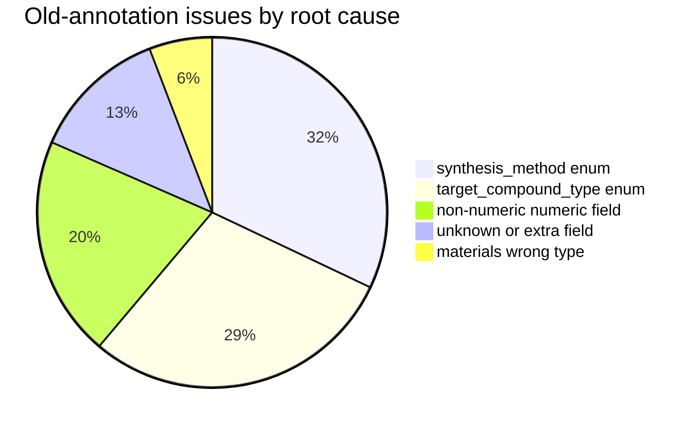
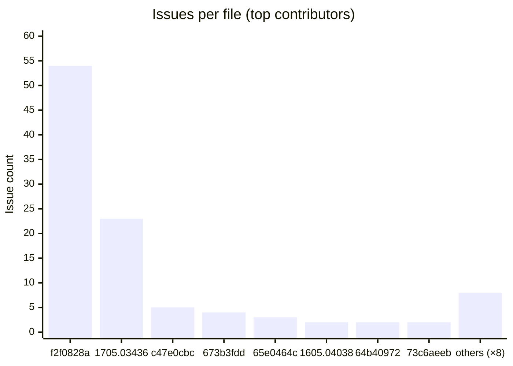
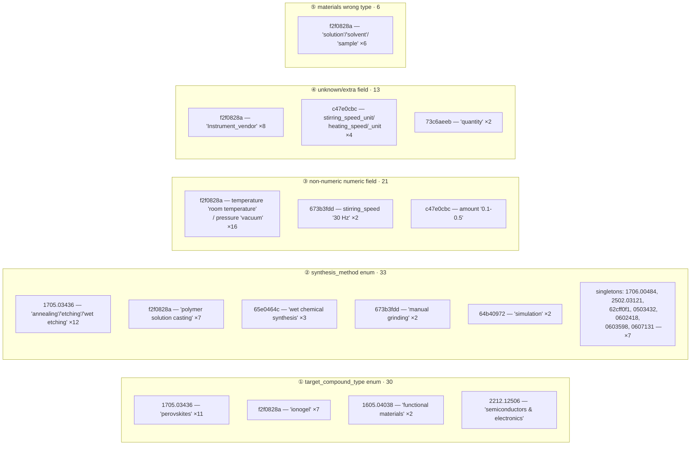

# Annotation Schema Validation: Old vs. New `result_human.json`

Generated from `examples/scripts/data_curation/validate_result_human_schema.py`.

## TL;DR

| Run | Files checked | Clean | With issues | Total issues |
|-----|--------------:|------:|------------:|-------------:|
| `--include-old` (validates `old/result_human.json`) | 76 | 60 | **16** | **103** |
| default (validates current/new `result_human.json`) | 38 | **38** | 0 | **0** |

The **old** annotations contained 103 schema violations across 16 files. Every one of
those issues has been resolved in the **new** annotations — the current files validate
100% clean. This document catalogs what was wrong and how the problems were distributed.

---

## Issue Categories

All 103 issues fall into **5 root-cause classes**:

| # | Class | What it means | Count | Share |
|---|-------|---------------|------:|------:|
| 1 | `target_compound_type` not in enum | Free-text material category instead of one of the 16 allowed values (e.g. `perovskites`, `ionogel`, `functional materials`, `semiconductors & electronics`) | 30 | 29% |
| 2 | `synthesis_method` not in enum | Free-text / mis-cased / off-list method (e.g. `annealing`, `wet chemical synthesis`, `arc melting`, `simulation`, `Pulsed laser deposition`) | 33 | 32% |
| 3 | Non-numeric value in numeric field | String where a `float` is required (`temperature: "room temperature"`, `pressure: "vacuum"`, `stirring_speed: "30 Hz"`, `amount: "0.1-0.5"`) | 21 | 20% |
| 4 | Unknown / extra field | Field not in the schema (`quantity`, `stirring_speed_unit`, `heating_speed`, `heating_speed_unit`, `Instrument_vendor`) | 13 | 13% |
| 5 | Wrong type for `materials` entry | Bare string where a `Material` dict is required (`"solution"`, `"solvent"`, `"sample"`) | 6 | 6% |



---

## Issues per File

Top contributors shown below; the full 16-file list is in the table that follows.
The top 8 files account for 95 of the 103 issues — the remaining 8 files have 1 issue each.



| File (`annotations/.../old/result_human.json`) | Issues | Classes present |
|---|---:|---|
| `f2f0828a5de4a3262edc73876809a9fe03ed6ff5` | 54 | 1, 2, 3, 4, 5 |
| `1705.03436` | 23 | 1, 2 |
| `c47e0cbc8b6feb8d28c3d9c1c29f98772ede6c27` | 5 | 3, 4 |
| `673b3fdd7be152b1d07c21f1` | 4 | 2, 3 |
| `65e0464ce9ebbb4db98ae397` | 3 | 2 |
| `1605.04038` | 2 | 1 |
| `64b40972b605c6803bd37ab4` | 2 | 2 |
| `73c6aeebd5877d2eb17d4961577d98216d503e6f` | 2 | 4 |
| `1706.00484` | 1 | 2 |
| `2212.12506` | 1 | 1 |
| `2502.03121` | 1 | 2 |
| `62cff0f127b1e42fe039c25e` | 1 | 2 |
| `cond-mat.0503432` | 1 | 2 |
| `cond-mat.0602418` | 1 | 2 |
| `cond-mat.0603598` | 1 | 2 |
| `cond-mat.0607131` | 1 | 2 |
| **Total** | **103** | |

---

## Category → File breakdown



---

## Representative examples per class

**① `target_compound_type` not in enum**
- `1705.03436` → `KTaO3`, `DyScO3`, `SrTiO3`, … got `'perovskites'`
- `f2f0828a` → `IG-C6`…`IG-C18` got `'ionogel'`
- `1605.04038` → got `'functional materials'` (should be `'functional materials & catalysts'`)
- `2212.12506` → got `'semiconductors & electronics'` (should be `'semiconductors & electronic'`)

**② `synthesis_method` not in enum**
- Off-list verbs: `'annealing'`, `'etching'`, `'wet etching and annealing'`, `'manual grinding'`, `'simulation'`, `'polymer solution casting'`, `'wet chemical synthesis'`, `'arc melting'`, `'floating-zone'`
- Casing / parenthetical noise: `'Pulsed laser deposition'`, `'pulsed laser deposition (pld)'`, `'molecular beam epitaxy (MBE)'`

**③ Non-numeric value in numeric field**
- `temperature: "room temperature"`, `pressure: "vacuum"` (`f2f0828a`)
- `stirring_speed: "30 Hz"` (`673b3fdd`)
- `amount: "0.1-0.5"` (`c47e0cbc`)

**④ Unknown / extra field**
- `Instrument_vendor` on equipment entries (`f2f0828a`)
- `stirring_speed_unit`, `heating_speed`, `heating_speed_unit` on conditions (`c47e0cbc`)
- `quantity` on materials (`73c6aeeb`)

**⑤ Wrong type for `materials` entry**
- A step's `materials[0]` was a bare string `"solution"` / `"solvent"` / `"sample"` instead of a `Material` object (`f2f0828a`)

---

## How to reproduce

```bash
# Validate the OLD annotations (surfaces the 103 issues)
uv run examples/scripts/data_curation/validate_result_human_schema.py --include-old

# Validate the CURRENT/NEW annotations (all clean)
uv run examples/scripts/data_curation/validate_result_human_schema.py
```
