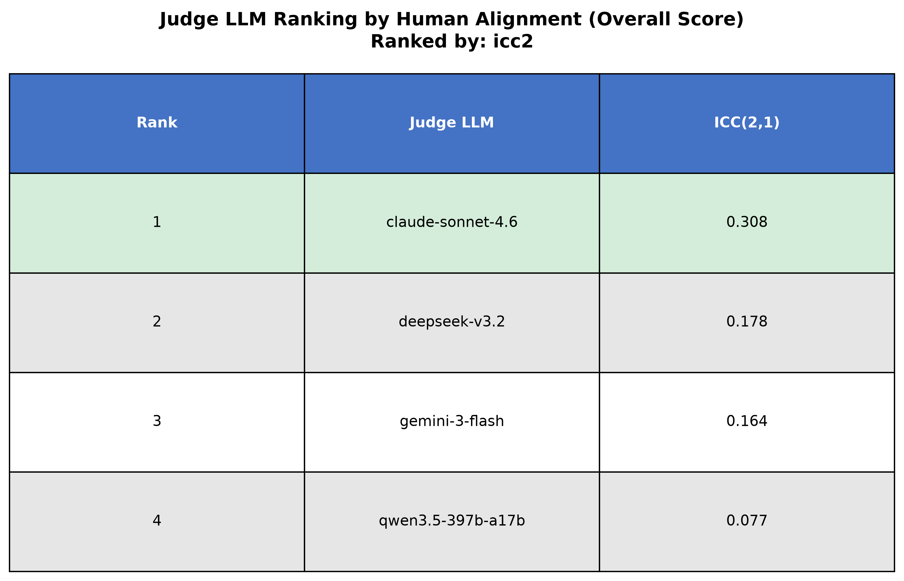
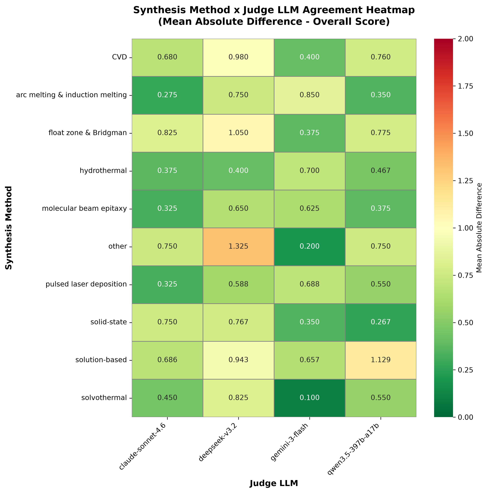

# Multi-LLM extraction and judge evaluation: findings

Analysis of the `annotations/<id>/result.json` grid (N extractors by M judges)
and `result_human.json` (the expert human judge) for LeMaterial-Synthesis. Four
models act as both **extractor** (`synth_llm`) and **judge** (`judge_llm`):
`claude-sonnet-4.6`, `deepseek-v3.2`, `gemini-3-flash`, `qwen3.5-397b-a17b`. The
human is a fifth, reference judge, with one score per extractor, positionally
aligned to `extractor_order`. All scores are 1 to 5 on 8 rubric dimensions, and
`overall_score` is the mean of the other 7.

## TL;DR

- **Best judge: `claude-sonnet-4.6`.** It is the only model that agrees with the
  human expert on both the *ordering* of extractions and their *absolute*
  scores. It wins 4 of the 5 ranking metrics (`abs_diff`, `kappa`, `icc2`,
  `icc3`). `gemini-3-flash` wins `rho` only, and that is an artifact of its
  near-constant scoring, not real agreement (see section 3).
- **Best extractor: `claude-sonnet-4.6`.** It gets the highest quality scores
  from both the human and the peer LLM judges, at high coverage, without
  inventing spurious materials.
- **LLM judges are more lenient and much less discriminating than the human.**
  `gemini-3-flash` gives almost everything a top score; the human is the
  strictest and most variable grader. More on this in section 5.

> **Two populations are used below. Do not conflate them.**
> **(A) Matched agreement set** (`compare_multi_llm_results_*.py`): each human
> material is fuzzy-matched to the LLM's extracted material, and 2 papers with
> null judge outputs are skipped, leaving n = 59 overall-score cells per judge.
> Used for human-vs-judge *agreement* (rho, kappa, ICC, abs_diff) in sections 3
> and 4.
> **(B) Full matrix** (`analyze_judge_extractor_insights.py`): every non-null
> evaluation, giving about 297 rows per judge and 235 human rows. Used for
> leniency, self-bias, inter-judge agreement, dimensions, and extractor quality
> in section 5.
> The human mean differs between the two by design (4.44 in A, 3.39 in B). That
> gap is itself a finding (section 5.5).

## 1. Intuition and takeaways

If you want the story without the tables, here it is.

**Why Claude is the best judge.** A useful judge has to be willing to disagree.
Claude is the one model that both ranks extractions the way the expert does and
lands close to the expert's actual scores. The others each fail in one
direction. Gemini behaves like a cheerleader: it hands out top marks to almost
everything, so it looks agreeable but carries little information, because a
grader that says "great" to every submission cannot separate good work from bad.
Deepseek is the opposite, a hard grader that marks everything down, so it is
miscalibrated the other way. Qwen is mostly noisy. Claude sits in the middle and
actually tracks the expert.

**Why the winning judge still looks weak on paper.** The experts rarely gave low
marks to the materials everyone agreed existed, so the scores bunch up near the
top. When nearly everything is a 4 or a 5, there is very little spread for any
correlation to grab onto, and even a perfect judge would look only moderately
correlated. So read the judge numbers as "who is closest," not "who is reliable
in an absolute sense."

**Why Claude is also the best extractor.** Judging blind, both the human and the
other models put Claude's extractions on top. When the expert and the crowd
independently land on the same answer, that is the signal worth trusting.

**Does any model favor its own work?** Mostly no, once you account for how
generous or harsh each model is in general. Gemini looks like it loves its own
output, but it loves everyone's output about equally. It only looks self-serving
because the other judges rate gemini's extractions low. Deepseek looks
self-critical, but it is simply harsh on everyone. The lesson for anyone
measuring self-preference: subtract a model's baseline leniency first, or you
will mistake generosity for narcissism.

**Where extractions actually break.** Getting the material list or the output
format right is the easy part. Reconstructing the synthesis *steps* faithfully
is where both the models and the human dock the most points. That is the part of
the pipeline worth improving.

**The main caution for using an LLM judge.** These judges are agreeable and
compressed. They almost never assign the low scores that a human expert gives to
a genuine failure. If you screen extractions with an LLM judge, expect it to
wave through mistakes a person would catch. Use it to rank candidates, not to
certify them.

**Trust in a judge is not uniform across chemistry.** The judges track the
expert best on the common wet-chemistry routes (hydrothermal, solution-based)
and on categories where quality genuinely varies, like metals and alloys. They
are least trustworthy, sometimes even ranking backwards from the expert, on
chemical vapor deposition and on two-dimensional materials, and on categories
where nearly every extraction is already near-perfect (ceramics and glasses),
where there is simply nothing left to tell apart. The pattern is consistent: an
LLM judge is only as informative as the spread of quality it has to grade.

## 2. How to reproduce

```bash
# 0. prerequisite: ICC fix merged (pingouin >=0.4 label handling), and the two
#    null-judge papers skipped in the compare_* scripts' skip_folders.

# A. human-vs-judge agreement and judge ranking. Run once per ranking metric;
#    outputs are suffixed by --rank-by so they do not overwrite each other.
uv run python examples/scripts/evaluation/compare_multi_llm_results_complete.py --rank-by icc2
uv run python examples/scripts/evaluation/compare_multi_llm_results_complete.py --rank-by abs_diff
uv run python examples/scripts/evaluation/compare_multi_llm_results_complete.py --rank-by rho
uv run python examples/scripts/evaluation/compare_multi_llm_results_complete.py --rank-by kappa
uv run python examples/scripts/evaluation/compare_multi_llm_results_complete.py --rank-by icc3

# B. per-category agreement (target_compound_type and synthesis_method)
uv run python examples/scripts/evaluation/compare_multi_llm_results_by_category.py

# C. deeper insight metrics (self-bias, leniency, dimensions, inter-judge)
uv run python examples/scripts/evaluation/analyze_judge_extractor_insights.py
```

All artifacts land in `results/agreement_analysis/` (this directory).

## 3. Metric glossary

| Metric | Meaning | Good |
|---|---|---|
| `rho` | Spearman rank correlation vs human | high |
| `kappa` | quadratic-weighted Cohen's kappa (binned) | high |
| `icc2` | ICC(2,1) absolute agreement (value and rank) | high |
| `icc3` | ICC(3,1) consistency (offset forgiven) | high |
| `abs_diff` | mean of \|judge − human\| on overall_score | low |
| `mean_diff` | signed judge minus human (bias: positive lenient, negative harsh) | near 0 |
| `L-mean / L-std` | a judge's own score distribution | reference |
| `self_preference` | (model on its own extraction) minus (peers on the same extraction) | near 0 |
| `self_bias_did` | difference-in-differences self-favoritism, leniency and quality controlled | near 0 |

## 4. Best judge: the evidence

Ranking against the human on the matched set (n = 59), from
`multi_llm_judge_ranking_*.json`:

| Judge | abs_diff (low) | rho | kappa | ICC2 | ICC3 | L-mean | mean_diff |
|---|---|---|---|---|---|---|---|
| **claude-sonnet-4.6** | **0.526** | 0.299 | **0.240** | **0.308** | **0.358** | 4.13 | −0.30 |
| gemini-3-flash | 0.533 | **0.333** | −0.023 | 0.164 | 0.253 | 4.92 | +0.49 |
| qwen3.5-397b-a17b | 0.597 | 0.154 | −0.018 | 0.077 | 0.082 | 4.22 | −0.22 |
| deepseek-v3.2 | 0.757 | 0.249 | 0.119 | 0.178 | 0.261 | 3.86 | −0.57 |

Rank-1 judge under each ranking metric:

| `--rank-by` | winner |
|---|---|
| abs_diff | **claude-sonnet-4.6** (0.526) |
| kappa | **claude-sonnet-4.6** (0.240) |
| icc2 | **claude-sonnet-4.6** (0.308) |
| icc3 | **claude-sonnet-4.6** (0.358) |
| rho | gemini-3-flash (0.333) |

Claude wins 4 of 5 metrics and is the only judge with a meaningfully positive
kappa (0.24; the other three sit near zero or below). Gemini's single `rho` win
is not real agreement: its kappa is −0.02 and its scores barely move (L-std 0.21,
mean 4.92). It orders a few items in a human-like way while assigning almost
everything a 5, so it cannot actually tell quality apart. Deepseek is the
harshest judge (mean_diff −0.57) and the worst on `abs_diff`.

Per-dimension agreement, with all judges pooled (`multi_llm_by_category.log`), is
weak on every dimension (rho 0.13 to 0.25, ICC2 0.09 to 0.20). The human's scores
sit tightly near 5 (H-std 0.39 to 0.78), which flattens every correlation-type
metric. Semantic Accuracy (rho 0.25) and Process Steps (rho 0.21) are the most
learnable; Structural Completeness (rho 0.13) the least.

One caveat for the per-category tables in
`multi_llm_agreement_by_material_category.csv`: gemini often has the lowest
`abs_diff` within a category (for example, solvothermal 0.10, "other" 0.20). That
is the same leniency artifact. Sitting near 5 keeps the absolute gap small
wherever the human also scored high. Rank categories by kappa or ICC, not by
`abs_diff`, or you will crown the least discriminating judge.

Plots: `multi_llm_judge_ranking_icc2.png`, `multi_llm_heatmap_synth_judge.png`.



## 5. Best extractor: the evidence

Per-extractor quality on the full set (`insights_extractor_quality.csv`):

| Extractor | Human overall | Peer-judge overall¹ | All-judge overall | LLM materials² |
|---|---|---|---|---|
| **claude-sonnet-4.6** | **3.665** | **4.318** | 4.288 | 68 |
| gemini-3-flash | 3.489 | 3.519 | 3.839 | **104** |
| qwen3.5-397b-a17b | 3.251 | 4.232 | 4.232 | 55 |
| deepseek-v3.2 | 3.148 | 4.115 | 3.949 | 69 |

¹ peer-judge is the mean of the 3 other judges, excluding the extractor's own
self-vote. ² distinct materials produced; the human annotated about 75.

Claude is first by the human and by the peer judges, the only model both agree
tops the list. Gemini is the interesting split: middle by the human (3.49) but
**last by peers (3.52)**. It also emitted 104 material entries against about 55
to 69 for the others while the human recognized roughly 75, so gemini
**over-extracts**, producing spurious or over-segmented materials that peers mark
down. Deepseek is weakest by the human (3.15).

Note the human-vs-peer split for deepseek and qwen: the human ranks them in the
bottom two, the peers rank them 2nd and 3rd. The peer judges are too lenient to
separate the middle of the pack, so the human is the arbiter to trust for the
extractor decision.

Plot: `multi_llm_heatmap_synth_judge.png` (rows are extractors, columns are
judges).

## 6. Insights

### 6.1 Judge leniency spectrum (`insights_judge_behavior.csv`)

| Grader | overall mean | overall std |
|---|---|---|
| gemini-3-flash | **4.785** | 0.472 |
| qwen3.5-397b-a17b | 4.015 | 0.626 |
| claude-sonnet-4.6 | 3.870 | 0.610 |
| deepseek-v3.2 | 3.489 | 0.786 |
| **HUMAN** | **3.390** | **1.591** |

Gemini is an extreme lenient grader (mean 4.79, and a flat 5.00 on format
compliance); deepseek is the strictest LLM. The human is both the harshest and
by far the most discriminating rater, with a standard deviation about 2 to 3
times any LLM's. In raw *level*, deepseek (3.49) is closest to the human (3.39),
but matching the average is not the same as agreeing case by case, and deepseek's
correlation is poor. Claude strikes the best balance between level and agreement.

### 6.2 Self-preference, or grading your own homework

Two views, from `insights_self_preference.csv` and `insights_self_bias_did.csv`:

| Model | self_preference¹ | self_bias_did² |
|---|---|---|
| gemini-3-flash | **+1.279** | **+0.444** |
| qwen3.5-397b-a17b | +0.003 | +0.032 |
| claude-sonnet-4.6 | −0.121 | +0.111 |
| deepseek-v3.2 | **−0.666** | +0.074 |

¹ (model on its own extraction) minus (peers on the same extraction). ²
difference-in-differences, which removes the model's leniency and its extraction
quality, and is the number to trust.

The raw `self_preference` is misleading because it is confounded by leniency.
Gemini's +1.28 looks like rampant narcissism, but the judge-by-extractor matrix
(`insights_judge_extractor_matrix.csv`) shows gemini-as-judge scores its own
extraction (4.80) *below* Claude's (4.90) and Qwen's (4.85). It is not
self-serving. It rates everything about 4.8, and peers rate gemini's weaker
extractions low (3.52), which inflates the raw gap. The controlled DiD (+0.44)
still leaves gemini with the largest residual self-bias, but that is modest on a
1 to 5 scale. Deepseek shows the opposite signature: its raw −0.67 makes it look
self-critical, but that is mostly its global harshness, and its DiD is only
+0.07. Claude (DiD +0.11) and qwen (+0.03) are close to neutral.

The takeaway for the paper: a naive self-vs-peer comparison is dominated by a
model's overall leniency. The leniency- and quality-controlled DiD shows all
self-bias is small (at most about 0.44 on a 1 to 5 scale), with gemini highest
and deepseek effectively free of self-favoritism, since its low self-scores are
harshness rather than humility.

### 6.3 Inter-judge agreement (`insights_interjudge_spearman.csv`)

Pairwise Spearman on overall_score:

| | claude | deepseek | gemini | qwen |
|---|---|---|---|---|
| **claude** | 1.00 | **0.68** | 0.56 | 0.56 |
| **deepseek** | 0.68 | 1.00 | 0.52 | 0.45 |
| **gemini** | 0.56 | 0.52 | 1.00 | **0.28** |
| **qwen** | 0.56 | 0.45 | 0.28 | 1.00 |

Claude and deepseek agree the most (0.68); gemini and qwen the least (0.28).
Claude has the highest average agreement with the others, which fits it being the
most central and reliable judge.

### 6.4 Dimension-level failure modes (`insights_dimension_means.csv`)

The lowest-scoring rubric dimensions show where extraction is systematically
weakest:

| Dimension | judges' mean | human mean |
|---|---|---|
| **process_steps** | **3.792** | **3.598** |
| structural_completeness | 3.851 | 3.905 |
| material_extraction | 3.978 | 3.614 |
| equipment_extraction | 3.969 | 3.982 |
| semantic_accuracy | 4.001 | 3.787 |
| conditions_extraction | 4.045 | 3.859 |
| **format_compliance** | **4.654** | **4.151** |

Process-step extraction is the hardest task, lowest for both the human and the
judges, and the obvious place to focus improvement. Format compliance is close to
saturated (about 4.7). One outlier stands out: deepseek-as-judge scores semantic
accuracy at 2.98, against 4.0 to 4.85 for the others, so it is unusually severe on
semantics. That is a per-judge quirk worth flagging.

### 6.5 Human vs LLM calibration, and the matched-vs-full gap

The human mean is 4.44 on the matched set but 3.39 on the full set, and the
standard deviation jumps from 0.61 to 1.59. The reading: when the extraction and
the human agree on *what* the material is (matched), recognized quality is high,
around 4.4. Across everything, including mismatched, over-extracted, and failed
materials, the human's scores are bimodal, with many 5s and a heavy low tail. The
LLM judges never reproduce that low tail. They stay compressed near the top no
matter what. This is the core measurement risk: LLM judges systematically miss
the extraction failures that a human expert catches.

### 6.6 Agreement by material type and synthesis method

From `multi_llm_agreement_by_material_category.csv` and
`multi_llm_by_category.log` (metrics averaged across the 4 judges; only
categories with n >= 5 shown, since the rest are too small to read).

By target compound type:

| Type | n | rho | kappa | ICC2 | human mean | judges − human |
|---|---|---|---|---|---|---|
| metals & alloys | 6 | 0.420 | **0.262** | **0.332** | **3.467** | +0.64 |
| nanomaterials | 18 | **0.434** | 0.033 | 0.149 | 4.531 | −0.15 |
| ceramics & glasses | 20 | 0.156 | 0.002 | 0.011 | 4.700 | −0.45 |
| two-dimensional materials | 5 | **−0.250** | −0.098 | **−0.201** | 4.400 | −0.08 |

By synthesis method:

| Method | n | rho | kappa | ICC2 | human mean | judges − human |
|---|---|---|---|---|---|---|
| hydrothermal | 12 | **0.715** | 0.146 | 0.387 | 4.275 | +0.23 |
| solution-based | 7 | 0.658 | **0.297** | **0.410** | 4.129 | +0.03 |
| pulsed laser deposition | 8 | 0.517 | 0.155 | 0.183 | 4.250 | −0.06 |
| solid-state | 6 | 0.298 | 0.000 | 0.058 | 4.833 | −0.45 |
| CVD | 5 | **−0.711** | 0.000 | −0.121 | 4.600 | −0.49 |

Three patterns stand out.

**Agreement follows score variance, not quality.** The judges track the human
best exactly where extraction quality varies. Metals and alloys are the
hardest-to-extract type (human 3.47, the lowest) and also the type with the best
value-agreement (ICC2 0.33, kappa 0.26), because there is a real spread of good
and bad extractions for a judge to order. The near-perfect categories are the
opposite: ceramics and glasses (human 4.70) and two-dimensional materials both
collapse to near-zero or negative agreement, because when almost everything is a
5 there is nothing left to discriminate. This is the ceiling effect from section
6.5, now visible category by category.

**Two categories where the judges rank backwards from the expert.** On CVD (rho
−0.71) and two-dimensional materials (rho −0.25), the pooled judges order
extraction quality roughly opposite to the human. Both samples are small (n = 5),
so treat these as flags to investigate rather than settled results, but a
negative correlation is worse than no judge at all and worth a closer look.

**Wet chemistry is the safe zone.** Hydrothermal (n = 12) and solution-based (n =
7) synthesis, the best-represented methods here, are where the judges are most
reliable (rho 0.72 and 0.66, and the two best ICC2 values). If an LLM judge is
going to be trusted anywhere, it is on these common solution routes. Note that
solution-based still has a large `abs_diff` (0.85): the judges get the *ordering*
right but are off on the absolute level, so calibrate before using their raw
scores.

Judge leniency also shifts by category: the judges are too easy on the hard
metals and alloys (+0.64 over the human) and somewhat too harsh on the easy,
high-scoring ceramics and solid-state categories.

Plots: `multi_llm_heatmap_target_compound_type.png`,
`multi_llm_heatmap_synthesis_method.png`.



### 6.7 Judge independence: leave-one-out ranking

A fair reviewer will worry that a model grading its own extraction inflates its
standing. To test this directly, each judge is re-ranked using only the cells
where it did *not* extract the material (leave-one-out), so no model ever grades
its own work. From `insights_judge_ranking_loo.csv`:

| Judge | cell set | n | rho | kappa | ICC2 | ICC3 |
|---|---|---|---|---|---|---|
| claude-sonnet-4.6 | all | 59 | 0.299 | 0.240 | 0.308 | 0.358 |
| claude-sonnet-4.6 | **no self** | 39 | **0.488** | **0.251** | **0.378** | **0.463** |
| deepseek-v3.2 | all | 59 | 0.249 | 0.119 | 0.178 | 0.261 |
| deepseek-v3.2 | **no self** | 47 | 0.212 | 0.145 | 0.176 | 0.265 |
| gemini-3-flash | all | 59 | 0.333 | −0.023 | 0.164 | 0.253 |
| gemini-3-flash | **no self** | 43 | 0.314 | −0.032 | 0.076 | 0.119 |
| qwen3.5-397b-a17b | all | 59 | 0.154 | −0.018 | 0.077 | 0.082 |
| qwen3.5-397b-a17b | **no self** | 48 | 0.168 | 0.000 | 0.072 | 0.072 |

The ranking is **unchanged**: Claude first, deepseek second, gemini third, qwen
fourth, whether or not self-judged cells are included. More telling, Claude's
agreement with the human *improves* once its self-cells are removed (ICC2 0.31 to
0.38, rho 0.30 to 0.49). Claude is a better judge of other models' extractions
than of its own, so its top ranking is not an artifact of grading itself. A
separate self-only slice confirms the same thing from the other side: Claude's
agreement with the human on its own extractions is actually poor (ICC2 0.04, on
just 20 cells), so those cells are not propping up its overall score.

This is the result to cite when a reviewer raises self-evaluation bias: the judge
ranking survives removing every self-judged cell, and the winner looks better,
not worse, without them.

### 6.8 Do the judges agree on the best extractor?

From `insights_extractor_ranking_by_judge.csv`, each grader's ranking of the four
extractors by mean overall_score:

| Grader | ranking of extractors | Spearman vs human |
|---|---|---|
| HUMAN | claude > gemini > qwen > deepseek | 1.00 |
| claude-sonnet-4.6 | claude > qwen > deepseek > gemini | 0.40 |
| deepseek-v3.2 | claude > qwen > deepseek > gemini | 0.40 |
| gemini-3-flash | claude > qwen > gemini > deepseek | 0.80 |
| qwen3.5-397b-a17b | claude > qwen > deepseek > gemini | 0.40 |

**Every judge, and the human, ranks `claude-sonnet-4.6` as the best extractor.**
That decision is unanimous and judge-independent, which is the one that matters
if Claude is chosen as the extractor. The full four-way orderings agree with the
human only moderately (Spearman 0.4 to 0.8, and with only four extractors a single
swap moves the number a lot), mostly because the judges rank gemini lower as an
extractor than the human does, consistent with gemini's over-extraction
(section 5). So the judges reproduce the top of the ranking reliably and disagree
on the crowded middle.

### 6.9 Recommended configuration

To sidestep the self-evaluation optics entirely, pair **Claude as the extractor**
with **deepseek-v3.2 as an independent judge**. Deepseek is the strongest
non-Claude judge: it is the only other model with a positive kappa, it holds
second place under the leave-one-out test (ICC2 0.176 vs gemini 0.076 and qwen
0.072 with self-cells removed), and it ranks Claude the best extractor. Gemini
looks competitive on rho and abs_diff, but its kappa is ≈0, so it cannot actually
discriminate quality, and it should not be used as the judge. Deepseek is the
harshest grader (a systematic negative offset), which is fine for ranking but
should be calibrated before its raw scores are read as absolute quality. The even
cleaner option for the paper is leave-one-out cross-judging: score each
extraction with an ensemble of the models that did not produce it, which removes
the conflict by construction and, per section 6.7, leaves the conclusions intact.

## 7. Threats to validity

- **Ceiling effect.** Human scores cluster near 5 (matched H-std 0.61). Low
  variance flattens rho, kappa, and ICC, so even the best judge only reaches ICC2
  around 0.31. The conclusions are relative (Claude is the least bad), not "Claude
  reproduces the human."
- **Small and clustered n.** The agreement set is 59 cells per judge, per-category
  cells are often 4 to 8, and rows within a paper are correlated, so p-values are
  optimistic.
- **Fuzzy material matching** (threshold 0.7) drops unmatched materials from the
  agreement set, and is the main driver of the matched-vs-full gap (section 6.5).
- **Positional human alignment.** `result_human.json` assumes `evaluations[i]`
  corresponds to `extractor_order[i]`. A mis-ordered file would silently
  misattribute human scores.
- **Two papers excluded** from the agreement set, because of null judge outputs
  from deepseek on `2883daff…` and `90233593…`. The insight script skips only
  those null cells, so its n is larger.
- **Self-selection.** Every model grades in a pool that includes itself. Section
  6.2's DiD controls for this, but on small self-cell counts (55 to 105).

## 8. Artifact index

| File | Contents |
|---|---|
| `multi_llm_judge_ranking_<metric>.{json,png}` | judge ranking under each `--rank-by` |
| `multi_llm_complete_<metric>.log` | full per-judge, per-dimension agreement log |
| `multi_llm_heatmap_synth_judge.png` | extractor-by-judge mean-score heatmap |
| `multi_llm_by_category.log` | agreement by dimension, extractor, judge, category |
| `multi_llm_agreement_by_material_category.csv` | per-category, per-judge agreement |
| `multi_llm_heatmap_{target_compound_type,synthesis_method}.png` | per-category heatmaps |
| `insights_judge_extractor_matrix.csv` | 4-by-4 mean overall_score matrix |
| `insights_self_preference.csv` | raw self vs peers |
| `insights_self_bias_did.csv` | leniency- and quality-controlled self-bias |
| `insights_judge_behavior.csv` | per-judge leniency, std, per-dimension means |
| `insights_extractor_quality.csv` | per-extractor human, peer, and all-judge scores, plus coverage |
| `insights_dimension_means.csv` | per-dimension means (failure modes) |
| `insights_interjudge_spearman.csv` | judge-by-judge agreement |
| `insights_judge_ranking_loo.csv` | judge ranking with all / no-self / self-only cells (section 6.7) |
| `insights_extractor_ranking_by_judge.csv` | each grader's ranking of the extractors (section 6.8) |
